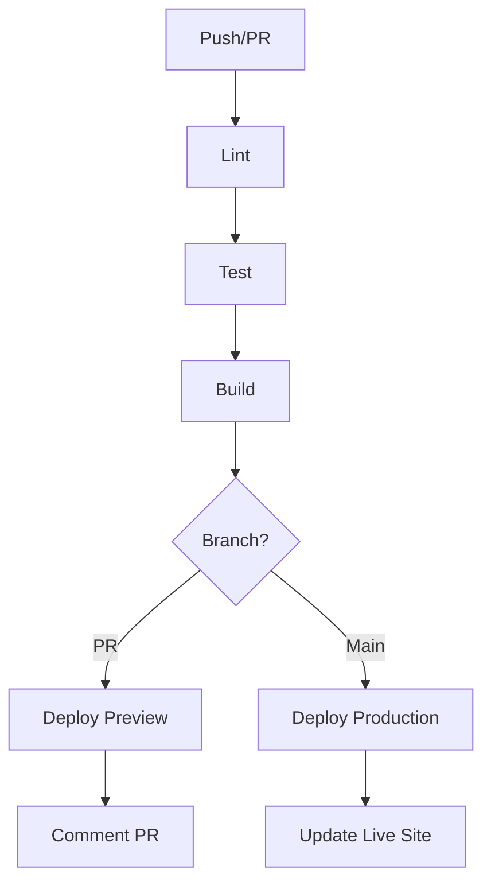

# CI/CD Pipeline Documentation

This directory contains GitHub Actions workflows for continuous integration and deployment.

## Workflows

### `ci.yml` - Main CI/CD Pipeline

Automatically runs on:
- **Push** to `main` or `develop` branches
- **Pull requests** targeting `main` or `develop` branches

## Pipeline Stages

### 1. Lint (`lint`)
- Runs ESLint to check code quality
- Enforces coding standards
- Must pass before tests run

### 2. Test (`test`)
- Runs Vitest test suite
- Generates coverage reports
- Uploads coverage to Codecov (optional)
- Requires lint job to pass first

### 3. Build (`build`)
- Compiles the application using Vite
- Validates build output
- Uploads build artifacts for deployment
- Requires test job to pass first

### 4. Deploy Preview (`deploy-preview`)
- **Triggers on:** Pull requests only
- Deploys to Vercel preview environment
- Comments PR with preview URL
- Allows testing changes before merging

### 5. Deploy Production (`deploy-production`)
- **Triggers on:** Push to `main` branch only
- Deploys to Vercel production environment
- Updates live application
- Creates deployment summary

## Required GitHub Secrets

To enable full CI/CD functionality, add these secrets to your GitHub repository:

### `VERCEL_TOKEN`
**Required for:** Vercel deployments

1. Go to [Vercel Account Settings > Tokens](https://vercel.com/account/tokens)
2. Create a new token
3. Add to GitHub: `Settings > Secrets and variables > Actions > New repository secret`
4. Name: `VERCEL_TOKEN`
5. Value: Your Vercel token

### `CODECOV_TOKEN` (Optional)
**Required for:** Code coverage reporting

1. Go to [Codecov](https://codecov.io/)
2. Add your repository
3. Copy the upload token
4. Add to GitHub secrets as `CODECOV_TOKEN`

## Setup Instructions

### 1. Install Vercel CLI (Local Development)
```bash
npm install -g vercel
```

### 2. Link Vercel Project
```bash
cd digital-menu-v2
vercel link
```

This creates `.vercel` directory with project configuration.

### 3. Configure GitHub Secrets
Add the required secrets as described above.

### 4. Push to Trigger Pipeline
```bash
git add .
git commit -m "feat: Add CI/CD pipeline"
git push origin main
```

## Pipeline Flow



## Pipeline Features

### ✅ Automated Quality Checks
- Linting with ESLint
- Unit tests with Vitest
- Build validation

### 🚀 Automated Deployments
- Preview deployments for PRs
- Production deployments on main
- Zero-downtime deployments

### 📊 Build Artifacts
- Build outputs saved for 7 days
- Available for download from Actions tab
- Useful for debugging

### 💬 PR Comments
- Automatic preview URL comments
- Status updates on checks
- Easy testing before merge

### 📝 Deployment Summaries
- Production deployment reports
- Pipeline step validation
- Quick status overview

## Local Testing

### Run lint locally:
```bash
npm run lint
```

### Run tests locally:
```bash
npm test
```

### Run build locally:
```bash
npm run build
```

### Preview build locally:
```bash
npm run preview
```

## Troubleshooting

### Pipeline Fails on Lint
- Run `npm run lint:fix` locally
- Fix remaining ESLint errors
- Commit and push

### Pipeline Fails on Tests
- Run `npm test` locally
- Fix failing tests
- Ensure all dependencies are installed
- Commit and push

### Pipeline Fails on Build
- Run `npm run build` locally
- Check for TypeScript/build errors
- Verify all imports are correct
- Commit and push

### Deployment Fails
- Verify `VERCEL_TOKEN` is set correctly
- Check Vercel project is linked
- Ensure `.vercel` directory exists
- Re-run the workflow

## Best Practices

1. **Always create PRs for new features** - Get preview deployments and review
2. **Wait for checks to pass** - Don't merge failing PRs
3. **Review preview deployments** - Test changes before merging
4. **Keep main branch stable** - Only merge tested and reviewed code
5. **Monitor production deployments** - Check deployment summaries

## Status Badges

Add to your README.md:

```markdown

```

## Pipeline Metrics

- **Average pipeline duration:** ~3-5 minutes
- **Lint:** ~30 seconds
- **Test:** ~45 seconds
- **Build:** ~1 minute
- **Deploy:** ~2 minutes

## Future Enhancements

- [ ] Add E2E tests with Playwright
- [ ] Add performance testing
- [ ] Add security scanning
- [ ] Add dependency vulnerability checks
- [ ] Add visual regression testing
- [ ] Add Lighthouse CI for performance metrics
